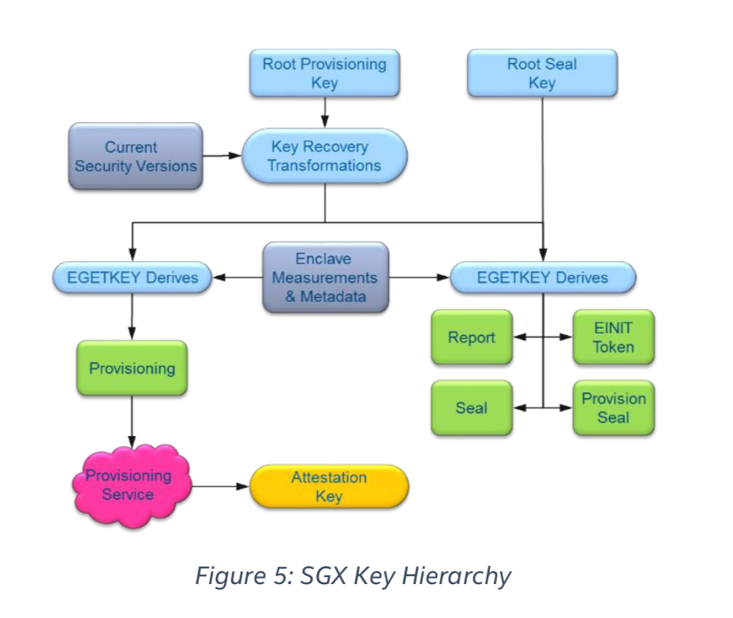
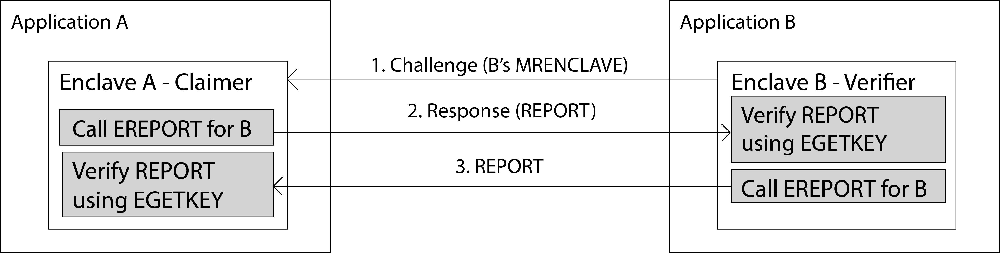
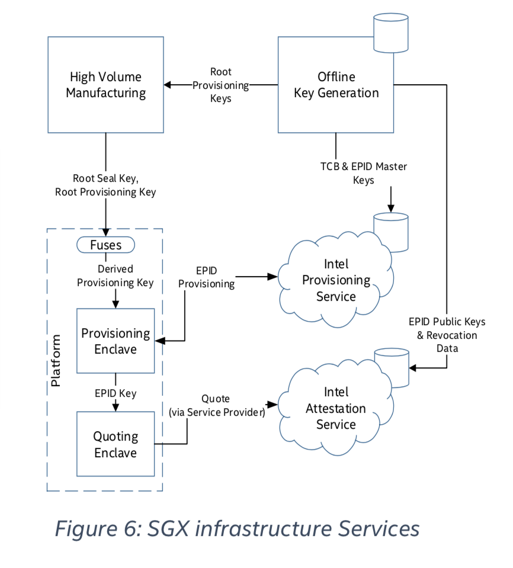
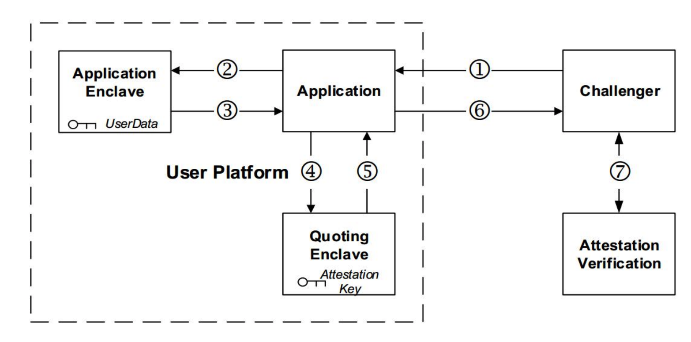
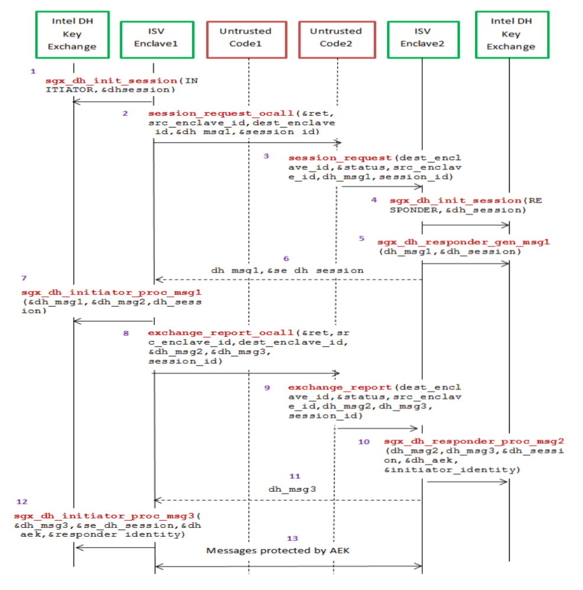
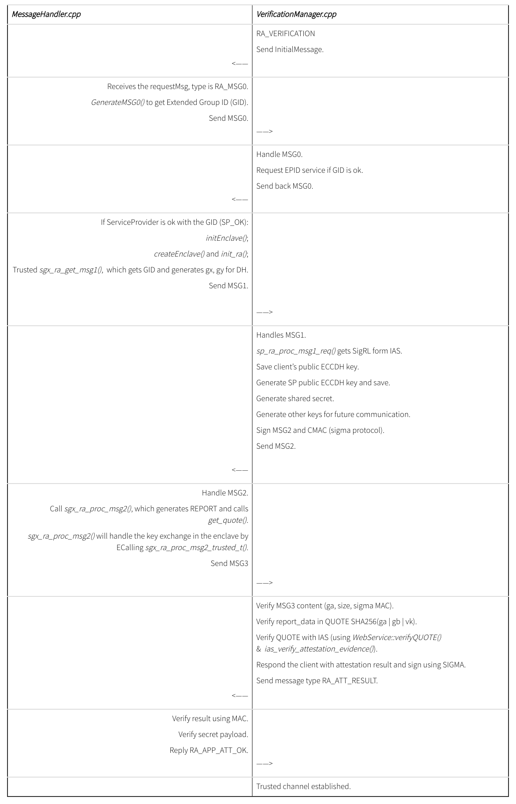

# Attestation

Sometimes enclaves need to collaborate with other enclaves on the same platform due to different reasons such as data exchange if the enclave is too small to hold all the information, or communication with Intel reserved enclaves to conduct specific Intel services.

Therefore, the two exchanging enclaves have to prove to each other that they can be trusted. In other scenarios when an SGX enabled ISV client requests secrets from its ISV client, password management service for example, the client have to prove to the server that the client application is running on a trusted platform that can process the secrets securely. Both of those two conditions require a proof of secured execution environment, and Intel SGX refers to this proving process as attestation.

There are two types of attestation with respect to the two above mentioned scenarios: **Local Attestation** and **Remote Attestation**.

The successful result of local attestation provides an authenticated assertion between two enclaves running on the same platform that they can trust each other and exchange information safely, while remote attestation provides this kind of verification for the ISV client to the server so that ISV server can confidently provides the client with the secrets it requested.

Before diving into the details of attestation, we need to clarify some required instructions and data.

## Device Root Keys

There are two device root keys that are fused to SGX CPU at production.

### Root Provisioning Key \(RPK\)

This key is randomly generated on a dedicated Hardware Security Module \(HSM\) within a special purpose facility called Intel Key Generation Facility \(iKGF\) which is guaranteed to be a well-guarded offline production facility. Intel is also responsible for maintaining a database of all keys ever produced by the HSM. RPKs are delivered out to different factory facilities, named by Intel’s formal publications as the “high volume manufacturing system”, to be integrated into processors’ fuses.

Intel stores all RPKs as they are the basis of how SGX processors demonstrate their genuineness through an online provisioning protocol. For this reason, the iKGF also forwards different derivations of each RPK to Intel’s online servers.

### Root Sealing Key \(RSK\)

This key is randomly generated automatically inside the CPU during production to be statistically different from part to part. Intel declares that it attempts to erase all production lines residues of this key so that each platform should assume that its RSK value is both unique and known only to itself. Most of the keys provided by enclave’s trusted interface base their derivation on platform’s RSK so that no other parties can known the keys.



## Enclave Measurement \(aka Software TCB\):

#### When an enclave is built and initialized, Intel SGX will generate a cryptographic log of all the build activities, including:

* Content: code, data, stack, heap
* Location of each page within the enclave
* Security flags being used

The “Enclave Identity”, which is a 256-bit hash digest of the log, is stored as MRENCLAVE as the enclave’s software TCB. In order to verify the software TCB, one should first securely obtain the enclave’s software TCB, then securely obtain the expected enclave’s software TCB and compare those two values.

## Two user instructions:

### REPORT Contains following data:

* Measurement of the code and data in the enclave.
* A hash of the public key in the ISV certificate presented at enclave initialization time.
* User data.
* Other security related state information \(not described here\).
* A signature block over the above data, which can be verified by the same platform that produced the report.

### `EREPORT`

This instruction generates a cryptographic structure, called REPORT, that binds `MRENCLAVE` to the target enclave’s REPORT KEY.

### `REPORT KEY`

Used by EREPORT to sign all reports generated on that specific platform and destined that for that enclave.

### `EGETKEY`

Enclaves can use EGETKEY instruction to get derivatives of device keys. `EGETKEY` produces symmetric keys for different purposes depending on invoking enclave attributes and the requested key type. There are five different key types. Two are sealing and report keys available for all enclave. The rest are limited only to SGX architectural enclaves.

`EGETKEY` uses Security Version Number \(SVN\) specified by the requesting enclave to define requested key characteristics. CPU SVN to reflect processor microcode version, or ISV SVN to reflect enclave software version. `EGETKEY` checks these values against those stored in `SIGSTRUCT` and only allows to obtain keys with SVN values lower or equal to those of the invoking enclave so that upgraded versions of the same software can retrieve keys created by former versions.

### `SIGSTRUCT`

Enclaves’ certificate is called `SIGSTRUCT` and is a mandatory supplement for launching any enclave. The `SIGSTRUCT` holds enclave’s `MRENCLAVE` together with other enclave attributes. `SIGSTRUCT`s are signed by the ISV with its private key, which was originally signed by an SGX launch authority. Intel is considered the primary enclave launch authority, however other entities can be trusted by the platform owner to authorize launching of enclaves. The respected launch authority is specified by its public key hash signed by Intel and stored on the platform.

We start with clarifying the process of local attestation and then remote attestation.

## Local Attestation

Before multiple enclaves collaborate with each other on the same platform, one enclave will have to authenticate the other locally using Intel SGX Report mechanism to verify that the counterpart is running on the same TCB platform by applying the `REPORT` based Diffie-Hellman Key Exchange. This procedure is referred as local attestation by Intel. The successful result of local attestation will offer a protected channel between two local enclaves with guarantee of confidentiality, integrity and replay protection.

### Local Attestation Abstract:



1. There are two enclaves on the same platform, referred to as Enclave A and Enclave B. We assume they have established a communication path between each other, and the path doesn’t need to be trusted. W.l.o.g we assume B is asking A to prove it’s running on the same platform as B.
2. First, B retrieves its `MRENCLAVE` value and sends it to A via the untrusted channel.
3. A uses `EREPORT` instruction to produce a report for B using B’s `MRENCLAVE`. Then A sends this report back to B. A can also include Diffie-Hellman Key Exchange data in the `REPORT` as user data for trusted channel creation in the future.
4. After B receives the `REPORT` from A, B calls `EGETKEY` instruction to get `REPORT` KEY to verify the `REPORT`. If the `REPORT` can be verified with the REPORT KEY, then B assures that A is on the same platform as B because the REPORT KEY is specific to the platform.
5. Then B use the `MRENCLAVE` received from A’s `REPORT` to create another `REPORT` for A and sends the `REPORT` to A.
6. A then also can do the same as step 4 to verity B is on the same platform as A.
7. By utilizing the user data field of the `REPORT`, A and B can create a secure channel using Diffie-Hellman Key Exchange. Information exchange can be encrypted by the shared symmetric key.

## Remote Attestation Primitives

This section introduces the design details of the remote attestation service provided by Intel.

### Overall View of Intel SGX Infrastructure Services



### Platform Provisioning

In order to transform a local REPORT into a remotely verifiable `QUOTE`, Quoting Enclave uses a platform unique asymmetric attestation key. The `QUOTE` can then be verified by a remote party using the corresponding public key.

So how does QE obtain this attestation key in the first place? In this tutorial we explain the provisioning process in which an SGX platform receives its remote attestation key.

Provisioning is the process by which an SGX device demonstrates to Intel its authenticity as well as its CPU SVN and other system components attributes, in order to receive an appropriate attestation key reflecting its SGX genuinely and TCB version. Normally, provisioning is done during platform initial setup phase, but re-provisioning can also be performed after purchase due to update to crucial system components such as firmware, BIOS or microcode due to vulnerabilities. In such cases, the attestation key may be replaced to reflect platform renewed TCB security level.

Attestation key is the core asset in the SGX ecosystem. Relying parties trust valid attestation signatures as an Intel signed certificate that guarantees the platform’s authenticity. In order to facilitate SGX provisioning services, Intel operates a dedicated online provisioning infrastructure. SGX provisioning and remote attestation protocol follows a group signature scheme developed by Intel called Enhanced Privacy ID \(EPID\). To implement the EPID provisioning process Intel provides an architectural enclave called the Provisioning Enclave \(PvE\).

### Provisioning Enclave \(PvE\)

The PvE is responsible for conducting the provisioning process on the platform against Intel’s online provisioning servers. In this process PvE demonstrates that is has a key that Intel put in a real SGX processor and in return, is provisioned with a unique platform attestation for future remote attestations. Both sides implement the EPID scheme join protocol; the PvE functions as a new joining member and Intel as the group membership issuer that issues new group membership credentials.

PvE proves its authenticity by using several SGX privileged key types which are accessible through EGETKEY instruction only by SGX architectural enclaves. Two of those keys are Provisioning Key \(PK\) and Provisioning Seal Key \(PSK\). The uniqueness of PvE and QE is based on their SIGSTRUCT certificates signed by Intel \(MRSIGNER\). Those enclaves are thus authorized to launch with privileged attributes in order to later obtain special keys by executing EGETKEY instruction.

Two phases are involved in the derivation process of PK. First, bind Root Provisioning Key to HW TCB. TCB key occurs during processors boot time by looping over PRF with the current platform SVN patch level which reflects platform’s firmware components. Second, add SW properties to the resulting PK. It occurs when EGETKEY is called and uses the TCB key as basis for derivation. PvE’s software elements are reflected by EGETKEY input parameters. Root Signing Key and Owner Epoch value are ignored in this case to render the same platform-specific key regardless of its current owner. The resulting PK is then a unique key that reflects both HW and SW components of the SGX platform. This process also minimizes the exposure of Root Provisioning Key.

### Provisioning Protocol

After getting the PK, the platform can start the provisioning process to get the attestation key.

#### 1. Enclave Hello

Once we have TCB specific PK, PvE generates two values to initiate the provisioning protocol. The first is a hash of the PK called Platform Provisioning ID \(PPID\). The second reflects the claimed TCB level based on current SVN. Both encrypted using IPS’s public key and sent to IPS.

#### 2. Server Challenge

Intel uses PPID to determine whether the platform has been previously provisioned. If so, an encrypted version of a previously generated attestation key is added to the server’s challenge. If not, the server determines the EPID group for that platform, and adds the EPID group parameters together with a liveliness nonce and a pre-computed TCB challenge to the message sent back to the platform.

Since all RPKs are stored by the offline Intel Key Generation Facility \(iKGF\), it can perform the same hardware and software TCB specific derivation process as performed by the PvE using EGETKEY \(how to get SW attributes?\) on every SGX device to produce its own provisioning key \(how to know which SGX is which?\). This PK is used to encrypt a random value to generate a platform specific TCB challenge. All pre-computed challenges are sent to Intel’s online servers to support the provisioning protocol.

#### 3. Enclave Response

After PvE decrypts the TCB challenge with its PK, it uses it to generate a TCB proof by using the TCB challenge as a key to CMAC the nonce received from Intel. Next, PvE generates a random EPID membership key and hides it mathematically according to EPID protocol so that IPS cannot learn the membership key.

To facilitate future attestation key retrieval service, the non-hidden membership key is encrypted by PvE using another special key, PSK. PSK derivation does not include the Owner Epoch and uses RSK as the root key for derivation. The PSK thus is not affected by the platform changing owners, and is exclusive to that specific platform.

If the platform has been formerly provisioned and the ongoing protocol is an attestation key retrieval or TCB update, the platform has to prove that it has never been revoked in the past. This is achieved by using PSK to decrypt the backed up attestation key copies obtained from the server, and using them to sign a selected message chosen by Intel.

Both the hidden and the encrypted EPID membership keys are sent, together with the TCB and non-revoked proofs.

#### 4. Completion

After receiving the response, IPS first validates the TCB proof using the value received from iKGF and continues the EPID Join protocol on success. The hidden membership key is processed to create a unique certificate signed with the EPID group issuer key and stored together with the encrypted membership key for future re-provisioning events. The final message completing the protocol is then sent by the server containing the signed certificate.

Platform’s membership key together with the matching signed certificate form a unique EPID private key. Since the attestation key is constructed collaboratively by both parties, no one can forge a valid membership signature produced by the platform.

#### 5. Final

PvE encrypts the attestation key with PSK and stores on the platform for future use. Since EPID groups are categorized according to TCB levels, EPID signature can thus be user to represent both platform’s SGX genuineness and its TCB level.

## Remote Attestation Process

Generally speaking, the goal of Remote Attestation is for a Hardware entity or a combination of Hardware and Software to gain the trust of a remote service provider, such that the service provider can confidently provide the client with the secrets requested. With Intel SGX, Remote Attestation software includes the application’s enclave, and the Intel-provided Quoting Enclave \(QE\) and Provisioning Enclave \(PvE\). The attestation Hardware is the Intel SGX enabled CPU. Remote attestation provides verification for three things: the application’s identity, its intactness \(that it has not been tampered with\), and that it is running securely within an enclave on an Intel SGX enabled platform.

### Sigma protocol

Sigma is a protocol that includes a **Diffie-Hellman key exchange**, but also addresses the weaknesses of DH. The protocol Intel SGX uses differs from the regular Sigma protocol in that the Intel SGX platform uses Intel EPID to authenticate while the service provider uses Public Key Infrastructure \(in regular Sigma, both parties use PKI\). Finally, the Key Exchange libraries require the service provider to use an ECDSA, not an RSA, key pair in the authentication portion of the protocol and the libraries use ECDH for the actual key exchange.

As a result of this exchange between the client and the service provider, a shared key between the enclave and the challenger is produced that can be used for encrypting secrets that are to be provisioned in the enclave. Once inside the enclave, these secrets could then be decrypted by the application.

### Diffie-Hellman Key Exchange \(DHKE\)

A method for exchanging keys over a public channel without leaking the actual key to other listeners. The cryptographic algorithm is explained here.

### Intel Enhanced Privacy ID \(EPID\)

It is an extension to an existing Direct Anonymous Attestation \(DAA\) scheme with some additions, for example the use of SigRL \(Signature Revocation List\). EPID enables signing objects without leaving a trace that can be uniquely backtracked to the signer, making the signing process anonymous. This is done by dividing signers to groups \(also known as EPID groups\), based on their processor type. This way they create signatures with their own secret keys, but the signatures can be verified only with the public key of the group they belong to, making it possible to check that the signer belongs to the right group, but impossible to uniquely identify the signer.

### Revocation Lists

SGX facilitates three types of Revocation Lists \(RLs\): Group-RL which holds all revoked EPID groups, Priv-RL listing all revoked private-keys of the same EPID group, and Sig-RL that lists tuples of a basename and its corresponding signature of all revoked members in the same EPID group.

### Trusted Computing Base \(TCB\)

An entity responsible for protecting the secret provisioned to the enclave \(both software and hardware\).

### Quoting Enclave \(QE\)

A special enclave on every SQX processor and is tasked entirely with handling the remote attestation. It receives REPORTs from other enclaves, verifies them and signs them with the attestation key before returning the result, also known as a QUOTE, to the application.

### SGX Service Providers

Relying parties are referred to as service providers and do not have to hold SGX enabled hardware. Service providers are expected to register to the IAS and meet a set of Intel defined requirements in order to submit attestation evidence for IAS verification. This registration binds service providers’ Transport Layer Security \(TLS\) certificate to a unique Service Provider ID \(SPID\), and permits access to the IAS services. Some of these main IAS services are: verifying ISV enclave Quotes, requesting updated attestation revocation lists and retrieving the assertion information history associated with a Quote.

### Remote Attestation Modes

The QE supports two Quote signature modes with different link-ability properties, Fully-anonymous and Pseudonymous Quotes. The link-ability property of a Quote is determined by a basename parameter signed using platform’s unique attestation key. Using the same attestation key to sign the same basename parameter multiple times yields pseudonymous Quotes that are easily linkable. This mode is used by service providers to keep track of revisiting users and protect against sybil attacks, while preserving user’s privacy. When a pseudonymous Quote is used, the IAS first validates that the basename used is associated to that specific service provider. This role of the IAS enforces user’s pseudonymous separation between different service providers. In contrast, by signing multiple signatures on different basenames, it is computationally infeasible to determine whether the Quotes were produced using the same attestation key or not, thus preserving platform’s anonymity. Therefore random basenames are used by the QE to sign Fully-anonymous Quotes.

### Remote Attestation Abstract



For remote attestation, both symmetric and asymmetric key systems are used. The symmetric key system is used in local attestation with only the quoting enclave and the EREPORT instruction having access to the authentication key. Asymmetric key system is used for creating an attestation that can be verified from other platforms. The attestation key itself is asymmetric \(EPID keys\).

#### There are mainly three platforms involved in Remote Attestation:

* The service provider \(challenger\)
* The application with its enclave and its QE
* Intel Attestation Service \(IAS\) that verifies the enclave

  Stages

### Detailed Stages

1. At first, the ISV enclave sends out an initial request to the remote service provider, which includes the **EPID group** the platform claims to currently be a member of.
2. If the service provider wishes to serve members of the claimed group, it may proceed by requesting an updated **SigRL** from the IAS.
3. he service provider then constructs a **challenge message** that consists its SPID, a liveliness random nonce, the updated SigRL and an optional basename parameter \(if a pseudonym signature is required\).
4. If the enclave supports the requested signature mode, it invokes the `EREPORT` instruction to create a locally verifiable report addressed to platform’s QE. In order to establish an authenticated secure channel between the enclave and the service provider, a **freshly generated ephemeral public key** may be added to the report’s user data field. The report and SP’s challenge are sent to QE.
5. _\(Local Attestation happens here\)_ The QE calls `EGETKEY` to obtain the `REPORT KEY` and verifies the report. If successful, QE calls `EGETKEY` again to receive platform’s Provisioning Seal Key to decrypt platform’s remote attestation key \(EPID private key\). The attestation key is first used to produce an identity signature by either signing the challenged basename or a random value, according to the attestation mode requested.
6. The attestation key is then used to compute two signatures of knowledge over the platform’s identity signature `MRENCLAVE`. **The first** proves the identity signature was signed with a key certified by Intel. **The second** is a non-revoked proof that proves the key used for the identity signature does not create any of the identity signatures listed in the challenged SigRL. A final `QUOTE` is then generated and encrypted using IAS’s public key, which is hardcoded in QE, and the result is sent back to the attesting enclave. The `QUOTE` holds the identity of the attesting enclave, execution mode details \(e.g. SVN level\) and additional data.
7. The enclave then forwards the `QUOTE` to the **SP** for verification.
8. Since the `QUOTE` is encrypted, it is verifiable exclusively by Intel. Hence, the service provider simply forwards the `QUOTE` to the **IAS** for verification.
9. The **IAS** examines the `QUOTE` by first validating its EPID proofs against its identity signature. It then verifies the platform is not listed on the group **Priv-RL** by computing an identity signature on the `QUOTE` basename for each private key in the list, and verifying that none of them equals the QUOTE’s identity signature. This finalizes the validity check of the platform, and the IAS then creates a new attestation **verification report** as a response to the SP. The Attestation Verification Report includes the QUOTE structure generated by the platform for the attesting enclave.
10. A **positive** Attestation Verification Report confirms the enclave as running a particular piece of code on a genuine intel SGX processor. It is then the responsibility of the SP to validate the ISV enclave identity and serve an appropriate response back to the platform.

## Remote Attestation Example

Remote Attestation code example is available [here](https://github.com/sangfansh)

Original unmodified version is available [here](https://github.com/svartkanin/linux-sgx-remoteattestation)

IAS Service Guide is available [here](https://software.intel.com/sites/default/files/managed/7e/3b/ias-api-spec.pdf)

### Before running the code, some settings have to be set in the GeneralSettings.h file:

* The application port and IP
* A server certificate and private key are required for the SSL communication between the SP and the Application \(which can be self-signed\)

```bash
openssl req -x509 -nodes -newkey rsa:4096 -keyout server.key -out server.crt -days 365
```

* The SPID provided by Intel when registering for the developer account
* The certificate sent to Intel when registering for the developer account
* IAS Rest API url \(should stay the same\)

### To be able to run the above code some external libraries are needed:

* Google Protocol Buffers \(should already be installed with the SGX SDK package\) otherwise install 

```bash
libprotobuf-dev libprotobuf-c0-dev protobuf-compiler
```

**All other required libraries** can be installed with the following command:

```bash
sudo apt-get install libboost-thread-dev libboost-system-dev curl libcurl4-openssl-dev libssl-dev liblog4cpp5-dev libjsoncpp-dev
```

After the installation of those dependencies, the code can be compiled with the following commands:

```bash
cd ServiceProvider
make
cd ../Application
make SGX_MODE=HW SGX_PRERELEASE=1
```

The sample application has two parts: **ServiceProvider** and the **Application**. The Application needs to prove to the ServiceProvider that it is running on a claimed trusted SGX enclave so that the Service Provider can proceed to provision secret data. The messages exchanged during the remote attestation process are serialized using [Google Protobuf](https://github.com/google/protobuf).

First let’s examine the **Application**. The entry point of the Application is inside isv\_app.cpp \(ISV stands for Individual Software Vendor\). It starts by initiating the `MessageHandler` that handles the messages to be exchanged during remote attestation.

### MessageHandler \(a wrapper of all of the networking functionalities\): 

The MessageHandler has a protected enclave that handles all the secrets, as well as the generation and processing of cryptographic messages. We can see that MessageHandler has several message generation and handling functions. Specifically they are functions in forms of `generateMsgx()` and `handleMsgx()`. Google Protobuf is used by those functions to serialize the messages to be exchanged via network transportation.

The MessageHandler also has a `NetworkManagerServer` object. The NetworkManagerServer object enables the Application to act as a server to initialize connection and binds itself to a client via SSL \(implementation detail in server.h, using object `Server* server`\). It also inherits `NetworkManager` class in order to serialize and send messages.



`msg -> init():`







When the `MessageHandler` msg is initialized using `init()`, the `NetworkManagerServer` object inside is also initialized. It causes the initialization of `Server` object, which sets up the SSL io\_service socket and the selected port. Then a function `incomingHandler()` is connected to the `NetworkManagerServer` as the `CallbackHandler`. This function is responsible for generating all the message replies according to the type of the message that it receives.

As mentioned above, `incomingHandler(string, int)` handles all of the incoming messages and generates corresponding replies. Let’s briefly examine this handler \(line 395 at `MessageHandler.cpp`\).



### There are four cases:

* RA\_VERIFICATION
* RA\_MSG0 
* RA\_MSG2
* RA\_ATT\_RESULT

Each case is one type of the messages that are exchanged in time order during remote attestation. 

Upon here, the ISV application’s MessageHandler has finished initialization.

`msg -> start()`:





Function `start()` calls NetworkManager’s `startService()` function, which calls Server’s `start_accept()` to start SSL service. Upton here, the ISV has started running and is ready for any incoming traffic.

### Now let’s examine `ServiceProvider`’s structure and initialization process.

`isv_app.cpp` inside `ServiceProvider`:



It’s the ServiceProvider Application itself. Similar to the client’s application, it has its own message handler `VerificationManager` since it acts as the verifier in the remote attestation process. Inside the VerificationManager, it has a `NetworkManagerClient` which also inherits `NetworkManager` and is responsible for the SSL connection as well as serializing and sending messages.

In addition, it has a `WebService` object to performs the verification phase with **Intel Attestation Service \(IAS\)** using the `QUOTE` sent from the client enclave. In one word, a `ServicePrivider` also acts as a wrapper of all the IAS requests and message processing, as well as any encryption key derivation, using `WebService`.



 `vm -> init()`:



First, dynamically allocate a new `ServiceProvider` to ensure freshness of secret. Then the function initializes `NetworkManagerClient` that will connect to the Server \(the Application\) using SSL. Finally, a `CallBackHandler` similar to the one of the Application is set up. The handler itself is the function `incomingHandler(string, int)` inside `VerificationManager` that will handle incoming messages coming from the Application during remote attestation \(line 132 at `VerificationManager.cpp`\).



### There are also four cases of handling messages: 

* RA\_MSG0 
* RA\_MSG1 
* RA\_MSG3 
* RA\_APP\_ATT\_OK 

Notice that at the end of the handler, it initializes the message stream with a `RA_VERIFICATION` type string and the actual `REQUEST`. By doing so right after SSL handshake, the ServiceProvider can immediately start the RA process by forwarding the remote attestation request to the Application. 

`vm -> start()`:







`NetworkManagerClient` starts the service by connecting the SSL client to server. Then the client starts the SSL handshake process with server. We can see that the `Client::handle_handshake()` function triggers the remote attestation by sending out the attestation request mentioned above if handshake is successful.

Upon here, `ServiceProvider` and Application are connected and remote attestation process has started.

Now let’s examine both `incomingHandler(string, int)` in `MessageHandler.cpp` and `VerificationManager.cpp` to reflect the remote attestation process between SP and ISV described in the tutorial.

### Summary of function calls:



\(Please refer to `Messages.proto` for message structure details.\)

\(Please refer to the two `incomingHandler`'s attached below for actual implementation.\)







## References:

1. [https://courses.cs.ut.ee/MTAT.07.022/2017\_spring/uploads/Main/hiie-report-s16-17.pdf](https://courses.cs.ut.ee/MTAT.07.022/2017_spring/uploads/Main/hiie-report-s16-17.pdf)
2. [https://www.idc.ac.il/en/schools/cs/research/Documents/jackson-msc-thesis.pdf](https://www.idc.ac.il/en/schools/cs/research/Documents/jackson-msc-thesis.pdf)
3. [https://software.intel.com/en-us/articles/innovative-technology-for-cpu-based-attestation-and-sealing](https://software.intel.com/en-us/articles/innovative-technology-for-cpu-based-attestation-and-sealing)
4. [http://tce.webee.eedev.technion.ac.il/wp-content/uploads/sites/8/2015/10/SGX-for-Technion-TCE.pdf](http://tce.webee.eedev.technion.ac.il/wp-content/uploads/sites/8/2015/10/SGX-for-Technion-TCE.pdf)
5. [https://www.idc.ac.il/en/schools/cs/research/Documents/jackson-msc-thesis.pdf](https://www.idc.ac.il/en/schools/cs/research/Documents/jackson-msc-thesis.pdf)
6. [https://software.intel.com/en-us/node/702983](https://software.intel.com/en-us/node/702983)
7. [https://software.intel.com/en-us/articles/code-sample-intel-software-guard-extensions-remote-attestation-end-to-end-example](https://software.intel.com/en-us/articles/code-sample-intel-software-guard-extensions-remote-attestation-end-to-end-example)
8. [https://arxiv.org/pdf/1801.05863.pdf](https://arxiv.org/pdf/1801.05863.pdf)
9. [https://software.intel.com/en-us/forums/intel-software-guard-extensions-intel-sgx/topic/747718](https://software.intel.com/en-us/forums/intel-software-guard-extensions-intel-sgx/topic/747718)
10. [https://eprint.iacr.org/2007/194.pdf](https://eprint.iacr.org/2007/194.pdf)

