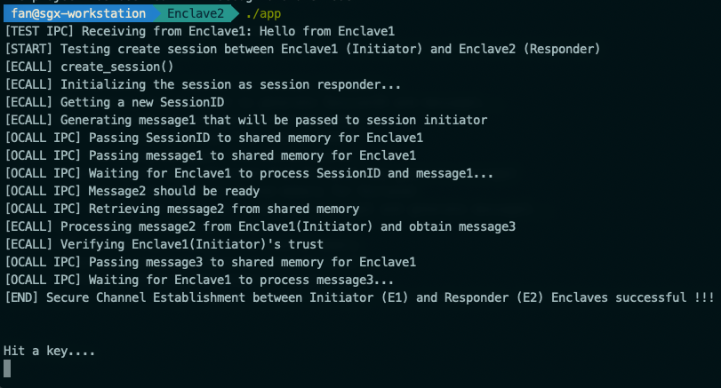

# Inter-process Local Attestation

## What is this?

Intel has provided a nice example of how to perform SGX local attestation among enclaves running in the same process. However, it is not very clear how to perform local attestation among enclaves running in different processes but on the same platform. This example serves the purpose to explain that.

## Recall Local Attestation Flow

Let's recall how local attestation is performed between two enclaves. Information is borrowed from [this](https://software.intel.com/en-us/node/702983) Intel thread.

This figure shows an example flow of how two enclaves on the same platform would authenticate each other.

1. Application A hosts enclave A and application B hosts enclave B. After the **untrusted** applications A and B have established **a communication path** between the two enclaves, enclave B sends its `MRENCLAVE` identity to enclave A. 
2. Enclave A asks the hardware to produce a `EREPORT` structure destined for enclave B using the `MRENCLAVE` value it received from enclave B. Enclave A **transmits** its report to enclave B via the **untrusted** application.
3. Once it has received the `EREPORT` from enclave A, enclave B asks the hardware to verify the report to affirm that enclave A is on the same platform as enclave B. Enclave B can then reciprocate by creating its own `EREPORT` for enclave A, by using the `MRENCLAVE` value from the report it just received. Enclave B **transmits** its report to enclave A.
4. Enclave A then verifies the report to affirm that enclave B exists on the same platform as enclave A.

**Note that** the **untrusted communication path** highlight above varies depending on whether the local attestation is intra-process or inter-process. In the [Local Attestation Sample Code](https://github.com/intel/linux-sgx/tree/master/SampleCode/LocalAttestation) provided by Intel SGX SDK, three enclaves are within the same application process, i.e. **intra-process**. Required data structures are being passed around by **ecalling into the destination enclave** with the destination enclave EnclaveID. 

## Intra-process Local Attestation

If two enclaves are within different application processes, they will not be able to access each other's attestation-handling APIs. Therefore, the **untrusted communication path** requires an extra layer of indirection, which can be IPC, TLS, etc.

Extra data transmission logics will need to be added to the untrusted applications in order to pass necessary data structures for ECDH and attestation process. At the end of inter-process local attestation, we should reach the same points as intra-process local attestation, i.e. a shared EDCH secret generated from SGX keys for secured future communication between two enclaves, and mutual identity verification of each other.

## Reference Implementation

In this example, the **untrusted communication path** between two enclaves from two application processes is established using IPC \(shared memory\).

Example code is available [here](https://github.com/sangfansh/SGX101_sample_code/tree/master/ProcessLocalAttestation).

To run the example, compile both in two terminal sessions using `make`. Then run Enclave1 first using `./Enclave1/app` followed by Enclave2 by executing `./Enclave2/app` in two separate terminal sessions.

We can examine the inter-process local attestation by monitoring the dynamic output, which looks like this eventually:

### Walk-through

The reference example is based on the [Local Attestation Sample Code](https://github.com/intel/linux-sgx/tree/master/SampleCode/LocalAttestation) from Intel SGX SDK, with an extra layer of IPC for passing required data structures using shared memory between two processes.

In the example, Enclave1 is the attestation **initiator** and Enclave2 is the attestation **responder**. 

Some potential confusions to clarify first: In both Enclave1 and Enclave2 directories, the original folders of three enclaves still exist. However, **only** _Enclave1_ \(Enclave1/Enclave1 and Enclave2/Enclave1\) is used in the two processes as the enclaves within.

The high-level interaction between the enclaved from two processes are self-explanatory from the outputs \(screenshots above\). But I will provide a detailed walk-through of the function calls involved and hope it helps to understand the overall approach better.

#### 1. Enclave1 initializes an EDCH session as the initiator

Enclave1 calls `sgx_dh_init_session(SGX_DH_SESSION_INITIATOR, &sgx_dh_session)` inside the enclave to initialize a new ECDH session as the initiator. Then Enclave enters `session_request_ocall()` to wait for Enclave2 to initialize and transmit the new **SessionID** and **message 1** via the **untrusted** shared memory.

#### 2. Enclave2 initializes an EDCH session as the responder

Enclave2 calls `sgx_dh_init_session(SGX_DH_SESSION_RESPONDER, &sgx_dh_session)` inside the enclave to initialize a new ECDH session as the responder. It then generates a new SessionID using `generate_session_id(&session_id)`. 

Enclave2 also creates message 1 using `sgx_dh_responder_gen_msg1((sgx_dh_msg1_t*)&dh_msg1, &sgx_dh_session)`. Message 1 contains the **report** of Enclave2 targeting Enclave1 to obtain `target_info`.

Finally, Enclave2 calls `session_reques_ocall()`, in which it passes the SessionID and message 1 to untrusted shared memory for Enclave1 to process. Enclave2 waits for message 2 from Enclave1 to further proceed.

#### 3. Enclave1 processes message 1 from Enclave2

Enclave1 process message 1 using `sgx_dh_initiator_proc_msg1(&dh_msg1, &dh_msg2, &sgx_dh_session)`. When message 1 is being processed, a shared ECDH key is computed and is embedded in message 2 for Enclave2. Message 2 also contains the report of Enclave1 targeting Enclave2 for verification.

Message 2 is passed to shared memory inside `exchange_report_ocall()` and Enclave1 then waits for Enclave2 to process message 2 and generate message 3. 

#### 4. Enclave2 processes message 2 from Enclave1

Enclave2 retrieves message 2 from Enclave1 inside `exchange_report_ocall()`. It then processes message 2 to get the shared ECDH key and verifies report of Enclave1 by calling `sgx_dh_responder_proc_msg2(&dh_msg2, &dh_msg3, &sgx_dh_session, &dh_aek, &initiator_identity)`. Message 3 is generated as a result and is passed to shared memory by calling `exchange_report_ocall()` again. A report of Enclave2 targeting Enclave1 is embedded in message 2 for verification.

#### 5. Enclave1 processes message 3 from Enclave2

Enclave1 retrieves message 3 inside `exchange_report_ocall()` from shared memory after waiting for Enclave2 to process. It then verifies the report of Enclave2 by calling `sgx_dh_initiator_proc_msg3(&dh_msg3, &sgx_dh_session, &dh_aek, &responder_identity)` and obtains the final shared ECDH key.

#### 6. End of local attestation

At the end of exchanging and processing of the three messages above, the two enclaves from two processes have verified the trust of each other, and shared a secret ECDH key for future communication session.

### TODO

1. The example has only integrated shared memory for passing data \(IPC\). Messages are demultiplexed using `sleep()` \(e.g. Enclave2 `sleep(5)` \) to wait for message 2 after sending message 1 to Enclave1. A better approach \(e.g. message queue\) needs to be integrated to synchronize messages.
2. Need to remove extra enclaves and cleanup legacy code not related to inter-process local attestation. 

