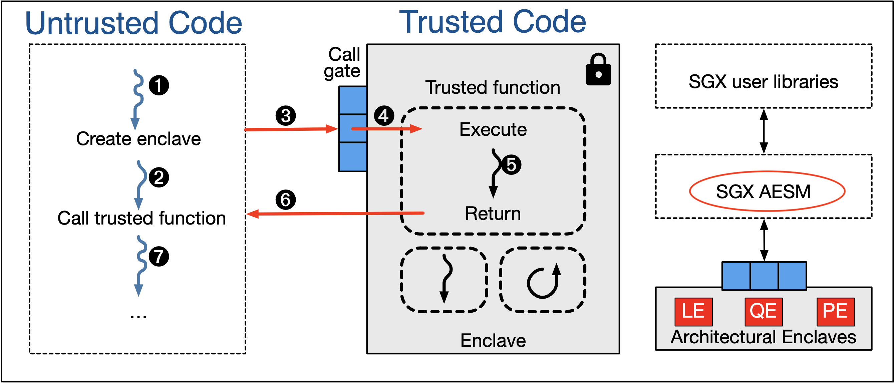
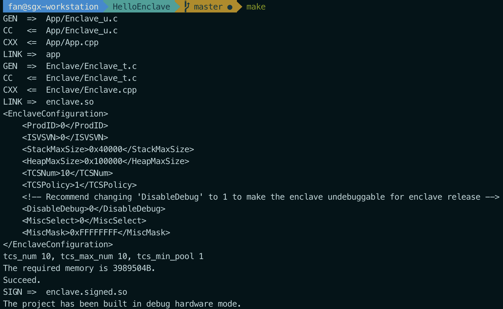
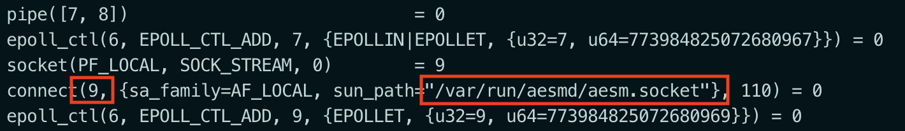
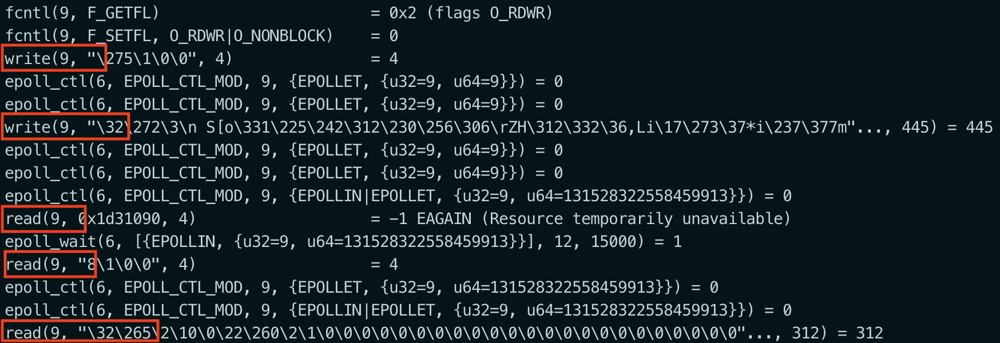

# Communication between Architectural and Application Enclaves

## What are architectural enclaves?

In order to allow a secured SGX environment to execute, several Architectural Enclaves \(AE\) are involved.

#### Launch Enclave \(LE\)

Launch Enclave is responsible for assigning `EINITTOKEN` to other enclaves wishing to launch on the platform. It verifies whether the requesting enclave is valid or not by examining the enclave's signature and identity, and generates the `EINITTOKEN` from **Launch Key**, which is only available to Launch Enclave.

#### Provisioning Enclave \(PvE\)

The Provisioning Enclave is responsible for retrieving the **Attestation Key** from **Intel Provisioning Service** using the certificate provided by Provisioning Certificate Enclave. 

#### Provisioning Certificate Enclave \(PcE\)

Provisioning Certificate Enclave is responsible for signing the processor certificate, which is requested by the provisioning enclave. It signs the certificate using the **Provisioning Key**, which is only available to Provisioning Certificate Enclave.

#### Quoting Enclave \(QE\)

Quoting Enclave is responsible for providing trust in the enclave identity and its execution environment during remote attestation process. It uses the **Attestation Key** offered by Provisioning Enclave and turns a `REPORT` \(locally verifiable\) into a `QUOTE` \(remotely verifiable\).

#### Platform Service Enclaves \(PSE\)

Platform Service Enclaves are responsible for offering other enclaves various trusted services, such as monotonic counters and trusted time, using **Management Engine** \(ME\).

## How do Application Enclaves communicate with Architectural Enclaves to utilize SGX services?

Simply put, it is through **Intel SGX AESM**, the Application Enclave Service Manager.

In more details, AESM is the system services management agent for SGX enabled applications. Those services include various components of the SGX system, such as launch approval, remote attestation quote signing, etc. They are implemented as Intel provided enclaves, i.e. **Architectural Enclaves** \(above mentioned\), and access to those enclaves is provided by AESM.

AESM is a part of SGX Platform Software, which is included in SGX SDK. Logic related to Architectural Enclaves is under code path [`linux-sgx/psw/ae/`](https://github.com/intel/linux-sgx/tree/master/psw/ae), which includes directories of different Architectural Enclaves. [`linux-sgx/psw/ae/aesm_service/`](https://github.com/intel/linux-sgx/tree/master/psw/ae/aesm_service) contains the AESM management agent, which provides the abstraction to access Architectural Enclaves. AESM runs as a daemon process `aesmd` when the system starts.

`aesmd` provides an untrusted API to communicate with Architectural Enclaves using a domain socket, whose path is hard-coded at  `/var/run/aesmd/aesm.socket`. All the messages transmitted between Architectural and Application Enclaves will go through AESM via this socket, and processed accordingly.

## Can you provide an example?

The simplest example will be an SGX Hello World application, as any communication between Architectural and Applications Enclaves requires AESM support, including enclave launch approval.

Let's use the same [HelloEnclave](https://github.com/sangfansh/SGX101_sample_code) application for demonstration. 

Compile the application with `make`.

Trace the execution of the SGX application by command `strace ./app`.

From the trace we can see that a connection to `/var/run/aesmd/aesm.socket` is made and a file descriptor is established \(`fd == 9` on my execution\).

Then the interaction between Architecture and Application Enclaves can be examined by looking at the data exchanged through AESM via the domain socket.

## References

1. [https://news.ycombinator.com/item?id=17470715](https://news.ycombinator.com/item?id=17470715)
2. [https://blog.quarkslab.com/overview-of-intel-sgx-part-2-sgx-externals.html](https://blog.quarkslab.com/overview-of-intel-sgx-part-2-sgx-externals.html)
3. [https://davejingtian.org/2017/11/10/some-notes-on-the-monotonic-counter-in-intel-sgx-and-me/](https://davejingtian.org/2017/11/10/some-notes-on-the-monotonic-counter-in-intel-sgx-and-me/)
4. [https://arxiv.org/pdf/1805.05847.pdf](https://arxiv.org/pdf/1805.05847.pdf)

