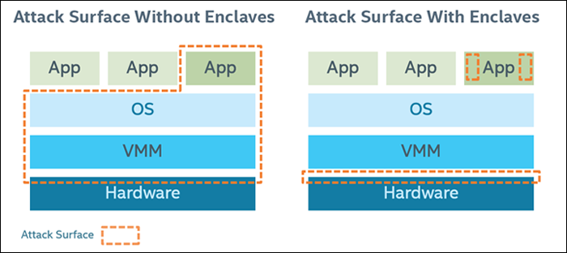

# Overview

## Background

Modern software applications tend to frequently process user private information such as usernames, passwords, credit records, encryption keys and health records. In most cases, **only designated recipients should be allowed to access this secret data**.

The operating system’s duty is to enforce security policies in order to eliminate unintentional leakage of those secrets to other users and applications. For example, the operating system can prevent unauthorized users or applications from accessing other users’ files or other applications’ memory space. The operating system can also restrict unprivileged users from accessing privileged regions such as the OS kernel. At the same time, applications also apply extra protection mechanisms such as data encryption to protect themselves from malicious parties even if the operating system itself is compromised.

However, there still persists a significant vulnerability in most of the computer systems. Even though there are numerous protection mechanisms one can apply to enhance security, there is virtually **no strategy to defense a malicious party with administrative privileges**. Such parties have unrestricted access to all system resources and all the running applications. Sophisticated malicious software can bypass protection schemes by extracting encryption keys or even the secret data itself direct from the memory.

In order to defense such attacks and offer users higher level of protection of their secret data, Intel designed SGX \(Software Guard Extension\). In short, Intel SGX offers **an extra set of CPU instructions to create enclaves**, areas that are protected by hardware and ensure confidentiality and integrity even in front of privileged operating systems.

## Introduction

Intel SGX \(Software Guard Extension\) is a new instruction set in Skylake Intel CPUs since autumn 2015. It provides a reverse sandbox that protects enclaves from:

* OS or hypervisor
* BIOS, firmware, drivers
* System management module \(Ring 2\)
* Intel management engine \(ME\)
* Any remote attack

In short, SGX architecture is a hardware-enforced security mechanism that requires **Trusted Computing Base \(TCB\), Hardware Secrets, Remote Attestation, Sealed Storage and Memory Encryption**.

Here, **TCB** will be the CPU’s package boundary and software components related to SGX.

**Hardware Secrets** will be two 128-bit keys at production: Root Provisioning Key and Root Seal Key. Notice that RPK is known to Intel and RSK is not, therefore most of he derived key are based on RSK. We will discuss this later in the tutorial.

**Remote Attestation** is enforced for the client to prove to the service provider that an enclave is running a given software, inside a given CPU, with a given security level, for a given Individual Software Vender \(ISV\). This is required before the service provider decides to provide requested secrets.

**Sealed Storage** is required to save secret data to untrusted media. Data and code inside enclaves are not secrets. They are just logics that are required to process the secret and most of them are open sourced or can be reverse engineered. Therefore, secrets are provisioned later by the service provider and should be stored out of the enclave through sealing mechanism when necessary \(e.g. for future usage\).

### In summary, Intel SGX offers the following protections from known hardware and software attacks:

* Enclave memory cannot be read or written from outside the enclave regardless of the current privilege level and CPU mode.
* Production enclaves cannot be debugged by software or hardware debuggers.
* The enclave environment cannot be entered through classic function calls, jumps, register manipulation, or stack manipulation. The only way to call an enclave function is through a new instruction that performs several protection checks.
* Enclave memory is encrypted using industry-standard encryption algorithms with replay protection. Tapping the memory or connecting the DRAM modules to another system will yield only encrypted data.
* The memory encryption key randomly changes every power cycle. The key is stored within the CPU and is not accessible.
* Data isolated within enclaves can only be accessed by code that shares the enclave.

As a result, the attack surface can be largely reduced after applying Intel SGX:

### However, there are still several security limitation faced by Intel SGX:

* Cache timing attacks
* Physical attacks. E.g. laser fault injection attacks
* Microcode malicious patching
* Untrusted I/O
* Human element. E.g. trusted development environment
* CPU bugs and bugs in dependencies.

Note that SGX trusted enclaves and microcode can be patched. However, memory encryption crypto cannot be patched since it is fused to hardware.

Nevertheless, those security concerns are out of the tutorial's scope. Now let's get started with SGX!

## Get Started

Let’s get started by prepare the environment for Intel SGX.

Before installing Intel SGX SDK, we have to first purchase an SGX-enabled Skylake CPU. Then SGX option has to be enabled in system BIOS. Finally, the Intel SGX SDK and Platform Software need to be downloaded. This tutorial will be focusing on Intel SGX on Linux using Ubuntu 16.04. SDK is available [here](https://github.com/intel/linux-sgx).

Please follow the instructions to get Intel SGX SDK and PSW ready.

The **Intel SGX Platform Service \(PSW\)** is required to run SGX enclaves. It contains drivers, services and Intel privileged enclaves for launch policy enforcement, EPID and remote attestation service and provisioning service.

The **Intel SGX SDK** is required to develop SGX enclaves and applications. It contains Intel custom libc and cryptographic libraries, each with 2 versions \(debug & release\). It also has tools such as `sgx_edger8r` to generate glue code \(we will discuss this in the enclave tutorial\) and `sgx_sign` to sign enclaves with development key.

After all the required libraries are installed, we can start developing applications with SGX in mind!

## Application Design

In order to create an application with SGX enabled, we need to establish enclaves, attestation and sealing.

### Enclave:

Application design with Intel SGX requires that the application be divided into two components:

* Trusted component: This is the enclave. The code that resides in the trusted code is the code that accesses an application’s secrets. An application can have more than one trusted component/enclave.
* Untrusted component: This is the rest of the application and any of its modules. It is important to note that, from the standpoint of an enclave, the OS and the VMM are considered untrusted components.

The trusted component should be as small as possible to save more protected memory and reduce attack surface. Meanwhile, enclaves should also have minimal trusted-untrusted component interaction.

### Attestation:

In the Intel SGX architecture, attestation refers to the process of demonstrating that a specific enclave was established on a platform. There are two attestation mechanisms: Local attestation occurs when two enclaves on the same platform authenticate to each other. Remote attestation occurs when an enclave gains the trust of a remote provider.

### Sealing:

Sealing is the process of encrypting data so that it can be written to untrusted memory or storage without revealing its contents. The data can be read back in by the enclave at a later date and unsealed \(decrypted\). The encryption keys are derived internally on demand and are not exposed to the enclave.

#### There are two methods of sealing data:

* Enclave Identity: This method produces a key that is unique to this exact enclave.
* Sealing Identity: This method produces a key that is based on the identity of the enclave’s Sealing Authority. Multiple enclaves from the same signing authority can derive the same key.

Now that we have a better understanding of the main structure of an SGX application, we will proceed our tutorial to provide separate detailed explanations of each of the three main components. Each individual discussion of the component will also be followed by an existing code example to help understand implementation details.

At the end of the tutorial, we will develop an SGX-enabled application \(a password manager\). And after that, you should be well equipped with all the necessary knowledge to develop your own SGX-enabled applications!

Now let's jump into the heart of SGX, Enclave.

## References:

1. [https://www.blackhat.com/docs/us-16/materials/us-16-Aumasson-SGX-Secure-Enclaves-In-Practice-Security-And-Crypto-Review.pdf](https://www.blackhat.com/docs/us-16/materials/us-16-Aumasson-SGX-Secure-Enclaves-In-Practice-Security-And-Crypto-Review.pdf)
2. [http://www.cs.tau.ac.il/~tromer/istvr1516-files/lecture10-trusted-platform-sgx.pdf](http://www.cs.tau.ac.il/~tromer/istvr1516-files/lecture10-trusted-platform-sgx.pdf)
3. [https://software.intel.com/en-us/articles/intel-software-guard-extensions-tutorial-part-1-foundation](https://software.intel.com/en-us/articles/intel-software-guard-extensions-tutorial-part-1-foundation)
4. [https://software.intel.com/en-us/blogs/2016/06/10/overview-of-intel-software-guard-extensions-instructions-and-data-structures](https://software.intel.com/en-us/blogs/2016/06/10/overview-of-intel-software-guard-extensions-instructions-and-data-structures)
5. [https://download.01.org/intel-sgx/linux-2.2/docs/Intel\_SGX\_Developer\_Guide.pdf](https://download.01.org/intel-sgx/linux-2.2/docs/Intel_SGX_Developer_Guide.pdf)

