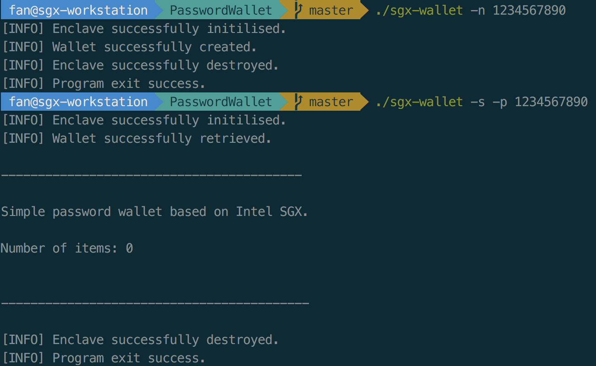

# Real-world Example

Now let’s build a linux version of Password Manager application. Project code is available [here](https://github.com/sangfansh/SGX101_sample_code).

Original unmodified version is available [here](https://github.com/asonnino/sgx-wallet).

The purpose of this application is to **create a password wallet that can safely store your passwords and display them when requested**. By implementing the wallet with SGX enclave protection, you are guaranteed to be able to securely create a wallet and manage the items inside it. The wallet will be sealed using SGX so that data are protected on disk and unsealed before any operation onto the wallet. Sealed wallet will be saved as filename “wallet.seal”.

The application starts with `app/app.cpp`.



First we start the application by creating an enclave for future secret operations. After successfully initializing the enclave, we will construct a console interface for users to interact with the application. Here we use `getopt()` to generate a console user interface with various options including: 

```text
h: help 
n: create new wallet 
p: master password 
c: change master password 
s: show wallet 
a: add item 
x: item’s title 
y: item’s username 
z: item’s password 
r: remove item 
And exception handling 
```

How to use the Command Line Interface:

```text
Show help: 
    sgx-wallet -h
Show version: 
    sgx-wallet -v 
Create a new wallet with master-password: 
    sgx-wallet -n master-password 
Change current master-password to: 
    sgx-wallet -p master-password -c new-master-password 
Add a new item to the wallet with title, username, and password: 
    sgx-wallet -p master-password -a -x item_title -y item_username -z item_password 
Remove item at index from the wallet: 
    sgx-wallet -p master-password -r item_index
```

We set flags for each of the operations and perform actions according to the options given by the user. After each interaction with the user, the enclave will be destroyed and the application will safely exit. 

In this application, a password `Wallet` is just a container of password `Items`. Both `Item` and `Wallet` objects are defined inside `wallet.h`. An Item has a user defined name, a username field and the corresponding password. A Wallet also has a size to indicate the number of Items it has, and a `master_password` which is requested before modifying Wallet contents.



Now let’s design the **trusted and untrusted boundary** of the application. In other words, we need to decide which functions will go to the trusted part \(run inside enclave\) and the untrusted part \(run outside enclave\).

In order to keep the amount of operations inside the enclave **minimal**, we only put functions with sensitive operations inside enclave. In addition, functions that utilizes system calls that are not supported by SGX enclave, such as file IO, will have to be put in the untrusted part and accessed using `OCalls`.

We conclude that any operation that is directly related to the wallet itself and the items inside should be put inside the enclave, including creating and showing the wallet, changing the wallet master password, and adding or removing password items.

Other operations such as saving the sealed wallet to and loading the wallet form the disk require file IO, which is not supported by SGX enclave, should be put outside the enclave.

Therefore, we will provide following functions to the user:

```text
trusted {

    public int ecall_create_wallet();
    public int ecall_show_wallet();
    public int ecall_change_master_password();
    public int ecall_add_item();
    public int ecall_remove_item();

};

untrusted {

    int ocall_save_wallet();
    int ocall_load_wallet();r
    int ocall_is_wallet();

};
```

The EDL file therefore looks like this:



 `int ecall_create_wallet(const char* master_password)`:



This function will take a user input `master_password` and create an empty `Wallet` for the user if no Wallet has already existed. First it check the master password against the predefined password policy. Then it checks whether a Wallet already exists. If not, a new Wallet object will be initialized with size 0 and the master password provided. Then the wallet is sealed using SGX sealing function and saved to disk as `wallet.seal`.

`int ecall_show_wallet(const char* master_password, wallet_t* wallet, size_t wallet_size)`:



This function will load the wallet from `wallet.seal` if exists and unseal it inside the enclave. If the master password provided by the user matches the one in the wallet, the wallet will be returned to the untrusted application to display. 

`int ecall_change_master_password(const char* old_password, const char* new_password)`:



This function will take in the old password of the wallet and a new password to update. The new password will first be validated against the password policy. Then the existing wallet will be loaded and unsealed inside the enclave. If the old password matches the one inside the wallet, the password field will be updated with the new password. Finally, the wallet will be sealed again and saved to the disk.

`int ecall_add_item(const char* master_password, const item_t* item, const size_t item_size)`:



This function will load and unseal the wallet inside the enclave first. Then if the master password matches the one inside the wallet, the new password item provided by the user will be added to the wallet. Finally, the wallet will be sealed again and saved to the disk. 

`int ecall_remove_item(const char* master_password, const int index)`:



The function takes in the master password of the wallet and the index of the item to be deleted from the wallet. First it checks the index provided does not exceed the maximum number of items a wallet can contain. Then it loads and unseals the wallet inside the enclave. If the provided master password matches the one inside the wallet, the item at the given index is removed. Finally the wallet is sealed again and saved to the disk.

`int ocall_save_wallet(const uint8_t* sealed_data, const size_t sealed_size)`:



This function uses the standard file IO to save the sealed wallet to disk as `wallet.seal`. 

`int ocall_load_wallet(uint8_t* sealed_data, const size_t sealed_size)`:



This function reads in the file `wallet.seal` into the application’s memory.

`int ocall_is_wallet(void)`:



This function verifies whether a wallet `wallet.seal` already exists on the disk. 

Other utility functions, such as displaying the wallet with format and providing explanations of the error code, are defined in `app/utils.cpp`. A `show_help` function is also defined here so that when user gives `-h` option in the console interface, a usage guide will be prompted.



In order to build and run the password wallet, first `cd sgx-wallet`, then `make`. Type `./sgx-wallet -options` to run the application. Sample output looks like:



