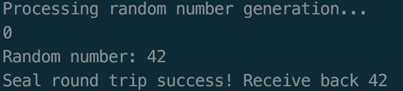

# Sealing

When an enclave is instantiated it provides protection to the data by keeping it within the boundary of the enclave. **Enclave developers should identify enclave data and/or state that is considered secret and potentially needs to be preserved across the following events during which the enclave is destroyed:**

* The application is done with the enclave and closes it.
* The application itself is closed.
* The platform is hibernated or shutdown.

In general, the secrets provisioned to an enclave are lost when the enclave is closed. But if the secret data needs to be preserved during one of these events for future use within an enclave, then it must be stored outside the enclave boundary before closing the enclave. In order to protect and preserve the data, a mechanism is in place which allows enclave software to retrieve **a key unique to that enclave**. This key can only be generated by that enclave on that particular platform. Enclave software uses that key to encrypt data to the platform or to decrypt data already on the platform. SGX refer to these encrypt and decrypt operations as sealing and unsealing, respectively.

There are two options when sealing data or future unsealing conditions \(different policies to derive sealing keys from **Root Sealing Key**, which is only known by the enclave\):

### Seal to Current Enclave:

This method binds the measurement of the current enclave, `MRENCLAVE`, to the key used by the sealing operation, using `EGETKEY` instruction. Therefore, only an enclave with the same `MRENCLAVE` will be able to generate the key to unseal the data. If any attribute related to the enclave has changed, the `MRENCLAVE` will also change. As a result, the sealing key will also change and the sealed data cannot be decrypted.

### Seal to the Enclave Author:

This method binds the identity of the enclave author, which is stored in the enclave’s `MRSIGNER` register at initialization time, to the sealing key derived from the Root Sealing Key using `EGETKEY` instruction. The Product ID of the enclave is also bound to the derived sealing key. Therefore, only an enclave with the same `MRSIGNER` measurement and the same **Product ID** can retrieve the sealing key and unseal the data.

There are two benefits of this mechanism over sealing to the enclave identity. **First**, it allows an enclave to be upgraded by the enclave author without a complex upgrade process to unlock data sealed to the previous version of the enclave and reseal it to the new version. **Second**, it allows enclaves from the same author to share sealed data.

## Sealing Abstract:

ISV enclaves are responsible for choosing and implementing the encryption scheme suitable for their needs when sealing their data. That is, SGX does not provide a complete sealing service, but rather a new security primitive \(available exclusively for enclaves\) based on `EGETKEY` features described.

First, allocate memory within the enclave for encrypted data and the sealed data structure which contains both the data to encrypt and additional data, such as application version and enclave information, which participates in the MAC calculation.

Then call the seal data API to perform the sealing operation, which will perform following steps:

1. Verify the input parameters. For example, make sure that the pointer to sealed data structure really points to the buffer inside the enclave.
2. Instantiate and populate a **key request structure** used in the `EGETKEY` operation to obtain a seal key:
3. Call `EREPORT` to obtain the ISV and TCB Security Version Numbers, which will be used in the key derivation
4. **Key Name:** Identifies the key required, which in this case is the seal key.
5. **Key Policy:** Use MRSIGNER to seal to the enclave’s author or MRENCLAVE to seal to the current enclave. Reserved bits must be cleared.
6. **Key ID:** Call RDRAND to obtain a random number for key wear-out protection.
7. **Attribute Mask:** Bitmask indicating which attributes the seal key should be bound to.
8. Call `EGETKEY` with the key request structure from the previous step to obtain the seal key.
9. Call the encryption algorithm to perform the seal operation with the seal key. It is recommended to utilize a function that performs `AES-GCM` encryption/decryption, such as the `Rijndael128GCM`, which is available in the Intel Integrated Performance Primitives Cryptography library.
10. **Delete** the seal key from memory to prevent accidental leaks.

Finally, save the seal data structure \(including the key request structure\) to external memory for future use within an enclave. The key request structure will be used in future enclave instantiations to obtain the seal key required for the decryption process.

## Unsealing Abstract:

First, allocate memory for the decrypted data.

Then call the unseal API to perform the unsealing operation, which will perform following steps:

1. **Verify** input parameters.
2. **Retrieve** the key request structure stored together with the seal data structure.
3. Call **EGETKEY** with the **key request structure** to obtain the seal key.
4. Call the **decryption algorithm** to perform the unseal operation using the seal key.
5. **Delete** the seal key from memory to prevent accidental leaks.
6. **Confirm** that the hash generated by the decryption algorithm matches the one generated during encryption to ensure integrity.

We use sample code example to explain implementation details.

## Sealing Example

This sealing example is only for illustration purpose. It generates a random number inside the enclave and calls the sealing api to seal it. Then it unseals the sealed data structure to verify the number. Code is available [here](https://github.com/sangfansh/SGX101_sample_code).

Original unmodified version is available [here](https://github.com/digawp/hello-enclave).

In `App.cpp`:



The application first initializes the enclave in the main function. Then it makes an `ECall` into the enclave to generate a random number \(a fake random number just for simplicity\).



In order to seal the number, the application first has to **allocate memory** for sealed data block \(line 30 at App.cpp\). Then it makes another `ECall` into the enclave to seal the random secret.

The `seal()` function is an `ECall` wrapper function of the trusted SGX sealing api. It passes the required parameters into function `sgx_seal_data()` provided by SGX SDK \(`Sealing.cpp`\). If this ECall returns successfully, the random secret will be securely sealed in `(sgx_sealed_data_t*)sealed_data`.



After the random secret is successfully sealed, the application makes another `ECall` `unseal()` to unseal the sealed\_data. Function `unseal()` is also a wrapper function of the trusted SGX sealing api `sgx_unseal_data()`. If this `ECall` returns successfully, the unsealed content of `sealed_data` will be stored into `int unsealed`.

Finally the application verifies the result by printing out and comparing the unsealed secret with the original generated random number \(line 50 at `App.cpp`\).

In order to compile and run this example, run `make` inside the example directory and type `./app` to run the application. It should produce some output like this:

## References:

1. [https://eprint.iacr.org/2016/086.pdf](https://eprint.iacr.org/2016/086.pdf)
2. [https://www.idc.ac.il/en/schools/cs/research/Documents/jackson-msc-thesis.pdf](https://www.idc.ac.il/en/schools/cs/research/Documents/jackson-msc-thesis.pdf)
3. [https://software.intel.com/en-us/articles/innovative-technology-for-cpu-based-attestation-and-sealing](https://software.intel.com/en-us/articles/innovative-technology-for-cpu-based-attestation-and-sealing)
4. [https://software.intel.com/en-us/blogs/2016/05/04/introduction-to-intel-sgx-sealing](https://software.intel.com/en-us/blogs/2016/05/04/introduction-to-intel-sgx-sealing)
5. [https://insujang.github.io/2017-10-09/intel-sgx-sealing/](https://insujang.github.io/2017-10-09/intel-sgx-sealing/)
6. [https://software.intel.com/en-us/node/702997](https://software.intel.com/en-us/node/702997)

